# 🎨 misworkflows

misworkflows genera imágenes SVG animadas con GitHub Actions y las guarda automáticamente en tu repositorio.

Unos momentos después, los archivos estarán disponibles en la carpeta `assets/`.

## Ejemplos

[](assets/xyvenqorix.svg)

## Uso

### Opción #1: Usar misworkflows como GitHub Action

1. Asegúrate de que en Settings > Actions > General > Workflow permissions esté seleccionada la opción Read and write permissions.

2. Copia tus workflows en la carpeta `.github/workflows/` de tu repositorio.

3. GitHub Actions generará automáticamente el siguiente archivo:

   - `assets/xyvenqorix.svg`

4. Abre el SVG para ver la animación, copiar su código o utilizarlo en tus proyectos.

5. ¡Diviértete! :)

## Workflow

### XYVENQORIX artwork

```yaml
name: XYVENQORIX artwork

on:
  push:
    branches: [main]
    paths-ignore:
      - assets/xyvenqorix.svg
  workflow_dispatch:

permissions:
  contents: write

jobs:
  build:
    runs-on: ubuntu-latest
    steps:
      - name: Crear y guardar mi SVG en main
        uses: actions/github-script@v7
        with:
          github-token: ${{ secrets.GITHUB_TOKEN }}
          script: |
            const font = {
              X:["10001","01010","00100","01010","10001"],
              Y:["10001","01010","00100","00100","00100"],
              V:["10001","10001","10001","01010","00100"],
              E:["11111","10000","11110","10000","11111"],
              N:["10001","11001","10101","10011","10001"],
              Q:["01110","10001","10001","10011","01111"],
              O:["01110","10001","10001","10001","01110"],
              R:["11110","10001","11110","10100","10010"],
              I:["11111","00100","00100","00100","11111"]
            };

            const name = "XYVENQORIX", cell = 12, gap = 3;
            let pixels = "", particles = "", order = 0;

            [...name].forEach((letter, letterIndex) => {
              font[letter].forEach((row, rowIndex) => {
                [...row].forEach((point, columnIndex) => {
                  if (point !== "1") return;

                  const x = 66 + letterIndex * 84 + columnIndex * (cell + gap);
                  const y = 94 + rowIndex * (cell + gap);
                  const delay = (order++ * .07).toFixed(2);

                  pixels += `<rect x="${x}" y="${y}" width="${cell}" height="${cell}" rx="3" fill="#39ff88" opacity="0">
                    <animate attributeName="opacity"
                      values="0;1;1;0;0"
                      keyTimes="0;.12;.65;.82;1"
                      dur="12s"
                      begin="${delay}s"
                      repeatCount="indefinite"/>
                  </rect>`;
                });
              });
            });

            for (let i = 0; i < 38; i++) {
              const x = 20 + ((i * 79) % 920);
              const y = 245 - ((i * 31) % 180);
              const duration = 3 + (i % 4);

              particles += `<circle cx="${x}" cy="${y}" r="${1 + (i % 3)}" fill="#39ff88" opacity="0">
                <animate attributeName="cy" values="${y};${y - 85}" dur="${duration}s" begin="-${i % 4}s" repeatCount="indefinite"/>
                <animate attributeName="opacity" values="0;.75;0" dur="${duration}s" begin="-${i % 4}s" repeatCount="indefinite"/>
              </circle>`;
            }

            const svg = `<svg xmlns="http://www.w3.org/2000/svg" width="960" height="280" viewBox="0 0 960 280">
              <defs>
                <linearGradient id="bg" x1="0" y1="0" x2="1" y2="1">
                  <stop offset="0%" stop-color="#05080d"/>
                  <stop offset="100%" stop-color="#0c3028"/>
                </linearGradient>
                <filter id="glow">
                  <feGaussianBlur stdDeviation="3" result="b"/>
                  <feMerge>
                    <feMergeNode in="b"/>
                    <feMergeNode in="SourceGraphic"/>
                  </feMerge>
                </filter>
              </defs>
              <rect width="960" height="280" rx="24" fill="url(#bg)"/>
              <rect x="16" y="16" width="928" height="248" rx="18" fill="none" stroke="#39ff88" stroke-opacity=".35"/>
              ${particles}
              <g filter="url(#glow)">${pixels}</g>
            </svg>`;

            const path = "assets/xyvenqorix.svg";
            let sha;

            try {
              const old = await github.rest.repos.getContent({
                owner: context.repo.owner,
                repo: context.repo.repo,
                path,
                ref: "main"
              });
              sha = old.data.sha;
            } catch (error) {
              if (error.status !== 404) throw error;
            }

            await github.rest.repos.createOrUpdateFileContents({
              owner: context.repo.owner,
              repo: context.repo.repo,
              path,
              branch: "main",
              message: "Actualizar artwork XYVENQORIX",
              content: Buffer.from(svg).toString("base64"),
              ...(sha ? { sha } : {})
            });
