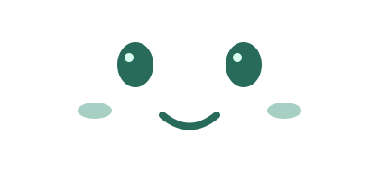

# 🎨 misworkflows

misworkflows genera imágenes SVG animadas con GitHub Actions y las guarda automáticamente en tu repositorio.

Unos momentos después, los archivos estarán disponibles en la carpeta `assets/`.

## Ejemplos

## Uso

### Opción #1: Usar misworkflows como GitHub Action

1. Asegúrate de que en Settings > Actions > General > Workflow permissions esté seleccionada la opción Read and write permissions.

2. Copia tus workflows en la carpeta `.github/workflows/` de tu repositorio.

3. GitHub Actions generará automáticamente los siguientes archivos:

   - `assets/carita.svg`
   - `assets/xyvenqorix.svg`

4. Abre los SVG para ver las animaciones, copiar su código o utilizarlos en tus proyectos.

5. ¡Diviértete! :)

## Workflows

### Carita simple

El workflow genera una carita SVG animada con ojos, brillos, cachetes y boca.

### XYVENQORIX artwork

El workflow genera un artwork SVG animado con el texto XYVENQORIX, partículas y efectos de brillo.

## Solución de problemas

Si el workflow falla con un error de permisos, comprueba que Read and write permissions esté habilitado.

## Repositorio

https://github.com/xyvenqorix/misworkflows
